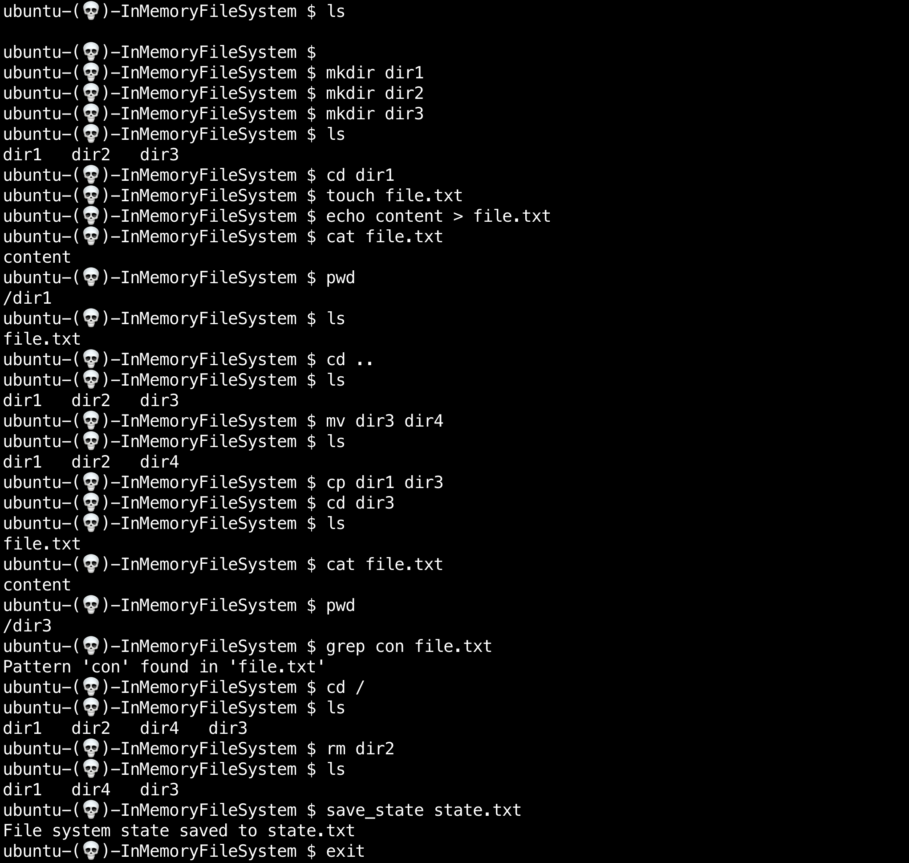
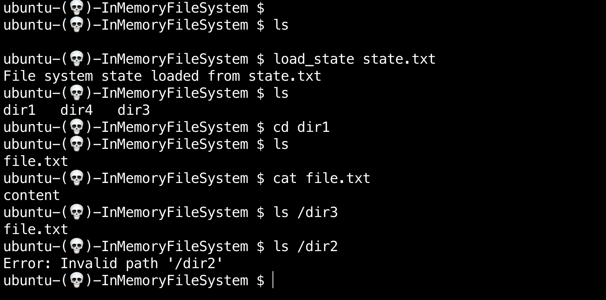

# In-Memory File System

This project implements a simple in-memory file system with basic file and directory operations. The file system operates within a Python script and supports various functionalities similar to a typical terminal.

## Table of Contents

- [Features](#features)
- [Requirements](#requirements)
- [Usage](#usage)
- [Implementation Details](#implementation-details)


## Features

1. **Directory Operations:**
   - `mkdir <directory_name>`: Create a new directory.
   - `cd <path>`: Change the current directory.
   - `ls [path]`: List the contents of the current or specified directory.
   - `mv <source_path> <destination_path>`: Move a directory to another location.
   - `cp <source_path> <destination_path>`: Copy a directory to another location.
   - `rm <path>`: Remove a directory.

2. **File Operations:**
   - `touch <file_name>`: Create a new empty file.
   - `echo 'content' > <file_name>`: Write text to a file.
   - `cat <file_name>`: Display the contents of a file.
   - `mv <source_path> <destination_path>`: Move a file to another location.
   - `cp <source_path> <destination_path>`: Copy a file to another location.
   - `rm <file_path>`: Remove a file.

3. **File System Navigation:**
   - Support for relative paths like `..`, `../`.
   - Support for absolute paths like `/`.
   - Navigate to specified absolute paths.

4. **State Management:**
   - `save_state <file_path>`: Save the current state of the file system to a file.
   - `load_state <file_path>`: Load a previously saved state to resume file system operations.

## Requirements

- Python 3.x

## Usage

1. **Clone the Repository:**
   ```bash
   git clone https://github.com/vijethasmeti/in-memory-file-system.git
   cd in-memory-file-system
   python3 main.py





## Implementation Details
The file system is implemented using an in-memory tree structure. Each node in the tree represents a directory or a file, and the tree is manipulated based on user commands. The state of the file system, including the current directory and file contents, can be saved and loaded.

